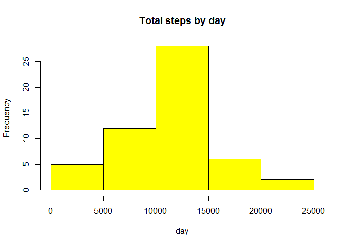
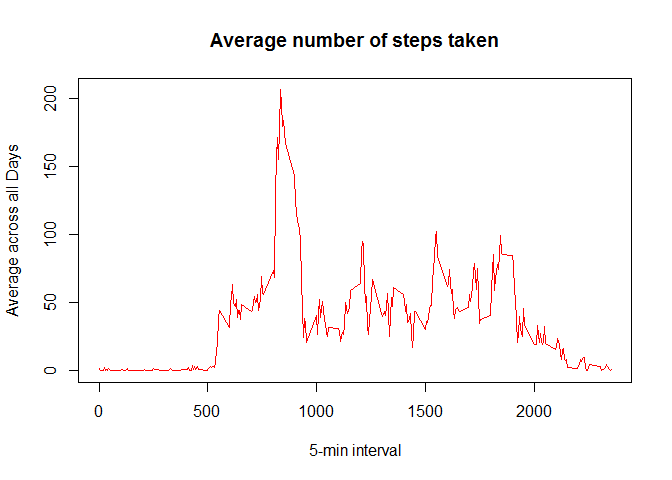
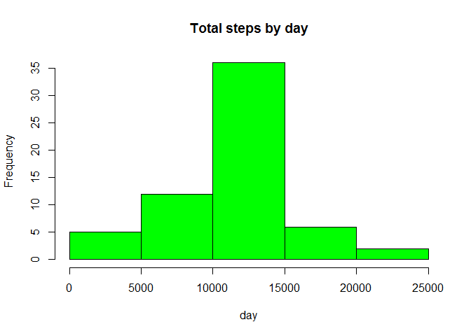

# Reproducible Research: Peer Assessment 1


## Loading and preprocessing the data


```r
  activity <- read.csv("D:/MYRWORKS/RepData_PeerAssessment1/RepData_PeerAssessment1/activity.csv", colClasses = c("numeric", "character", "numeric"))
  head(activity)
```

```
##   steps       date interval
## 1    NA 2012-10-01        0
## 2    NA 2012-10-01        5
## 3    NA 2012-10-01       10
## 4    NA 2012-10-01       15
## 5    NA 2012-10-01       20
## 6    NA 2012-10-01       25
```

```r
  names(activity)
```

```
## [1] "steps"    "date"     "interval"
```

```r
  library(lattice)
```

```
## Warning: package 'lattice' was built under R version 3.1.3
```

```r
  activity$date <- as.Date(activity$date, "%Y-%m-%d")
```


## What is mean total number of steps taken per day?

```r
  StepsTotal <- aggregate(steps ~ date, data = activity, sum, na.rm = TRUE)
  head(StepsTotal)
```

```
##         date steps
## 1 2012-10-02   126
## 2 2012-10-03 11352
## 3 2012-10-04 12116
## 4 2012-10-05 13294
## 5 2012-10-06 15420
## 6 2012-10-07 11015
```

```r
#Histogram  Display
  hist(StepsTotal$steps, main = "Total steps by day", xlab = "day", col = "yellow")
```

 

```r
#Mean and median of the total number of steps taken per day
#Mean
  mean(StepsTotal$steps)
```

```
## [1] 10766.19
```

```r
#Median
  median(StepsTotal$steps)
```

```
## [1] 10765
```

## What is the average daily activity pattern?

```r
#Time series plot 
  time_series <- tapply(activity$steps, activity$interval, mean, na.rm = TRUE)
#The plot 

plot(row.names(time_series), time_series, type = "l", xlab = "5-min interval", 
    ylab = "Average across all Days", main = "Average number of steps taken", 
    col = "red")
```

 

```r
# 5-minute interval
max_interval <- which.max(time_series)
names(max_interval)
```

```
## [1] "835"
```


## Imputing missing values


```r
#Total number of missing values in the dataset 
activity_NA <- sum(is.na(activity))
activity_NA
```

```
## [1] 2304
```

```r
#Devise a strategy for filling in all of the missing values in the dataset
StepsAverage <- aggregate(steps ~ interval, data = activity, FUN = mean)
fillNA <- numeric()
for (i in 1:nrow(activity)) {
    obs <- activity[i, ]
    if (is.na(obs$steps)) {
        steps <- subset(StepsAverage, interval == obs$interval)$steps
    } else {
        steps <- obs$steps
    }
    fillNA <- c(fillNA, steps)
}

#Create a new dataset that is equal to the original dataset 
new_activity <- activity
new_activity$steps <- fillNA

#Make a histogram of the total number of steps taken each day and Calculate and report the mean and median total number of steps taken per day

StepsTotal2 <- aggregate(steps ~ date, data = new_activity, sum, na.rm = TRUE)

# Histogram is 
hist(StepsTotal2$steps, main = "Total steps by day", xlab = "day", col = "Green")
```

 

```r
# And the mean and median is
mean(StepsTotal2$steps)
```

```
## [1] 10766.19
```

```r
median(StepsTotal2$steps)
```

```
## [1] 10766.19
```


## Are there differences in activity patterns between weekdays and weekends?

```r
# Create a new factor variable in the dataset with two levels - "weekday" and "weekend"

day <- weekdays(activity$date)
daylevel <- vector()
for (i in 1:nrow(activity)) {
    if (day[i] == "Saturday") {
        daylevel[i] <- "Weekend"
    } else if (day[i] == "Sunday") {
        daylevel[i] <- "Weekend"
    } else {
        daylevel[i] <- "Weekday"
    }
}
activity$daylevel <- daylevel
activity$daylevel <- factor(activity$daylevel)

stepsByDay <- aggregate(steps ~ interval + daylevel, data = activity, mean)
names(stepsByDay) <- c("interval", "daylevel", "steps")

#Make a panel plot containing a time series plot 
xyplot(steps ~ interval | daylevel, stepsByDay, type = "l", layout = c(1, 2), 
    xlab = "Interval", ylab = "Number of steps")
```

 

